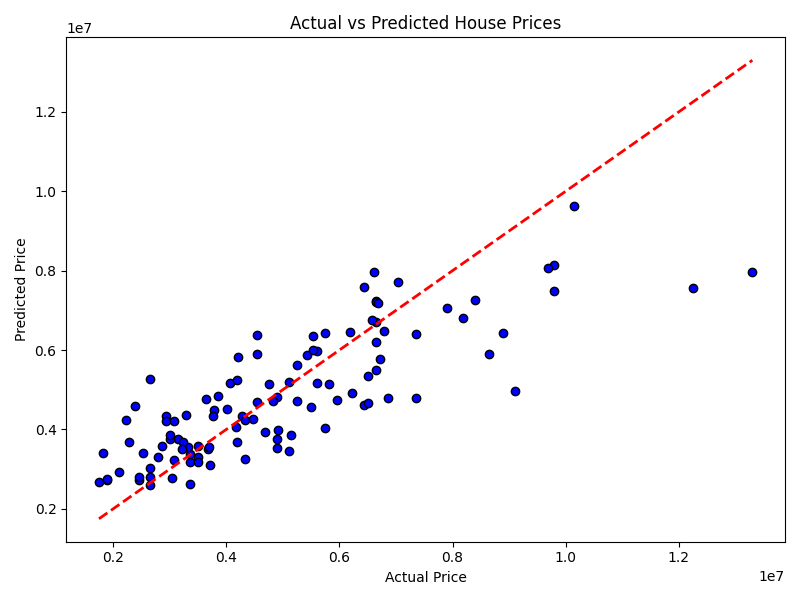

# House Price Prediction using Linear Regression

This project is part of the AI & ML Internship and demonstrates the implementation of **Simple and Multiple Linear Regression** using Python and scikit-learn.

## 📁 Dataset

- Dataset Name: `housing.csv`
- Rows: 545
- Columns: 13 (including categorical and numeric features)
- Target Variable: `price`

## 🛠️ Tools Used

- Python
- Pandas
- Matplotlib
- Scikit-learn

## 🔍 Project Workflow

1. Loaded and explored the dataset.
2. Checked for missing values and summary statistics.
3. Applied one-hot encoding to convert categorical variables to numeric.
4. Split the data into training and testing sets.
5. Trained a linear regression model using `LinearRegression()`.
6. Evaluated the model using:
   - Mean Absolute Error (MAE)
   - Mean Squared Error (MSE)
   - R² Score
7. Interpreted model coefficients.
8. Visualized Actual vs Predicted prices.

## 📊 Sample Output

### 🔹 Dataset Preview

### 🔹 Regression Plot
A scatter plot of actual vs predicted prices showing the regression line.

## 👨‍💻 Author

**Sudhatanmai**

## 🔗 Repo Name

`House-price-regression-AIML`

## 📬 Feel free to fork, star ⭐ and contribute!
